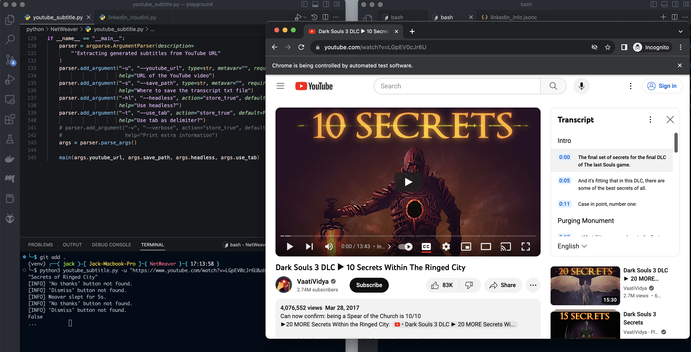
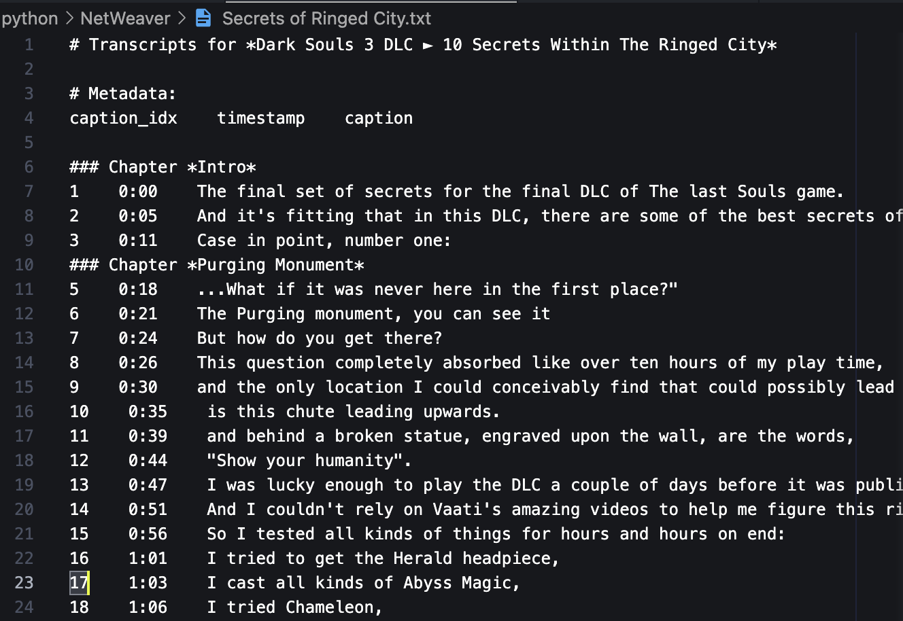
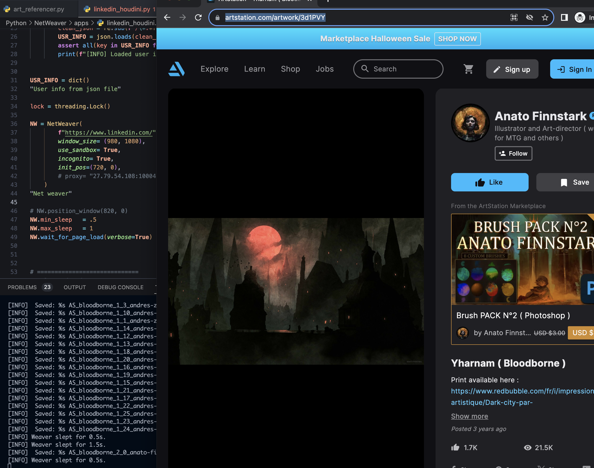

<h1 style="color: white; background: linear-gradient(43deg, #4158D0 0%, #d253c3 58%, #FB5959 100%); text-align: center; padding: 10px; box-shadow: 3px 3px 10px rgba(0,0,0,0.2); font-family: 'Segoe UI', Tahoma, Geneva, Verdana, sans-serif; border-radius: 5px; text-transform: capitalize;">
  Net Weaver
</h1>

Built upon Selenium, this suite of tools aims to achieve easier automations for web testing. It simplifies the collection and formatting of references for uses including prompt engineering, picture references gathering, instagram scrapping, etc.

*If you are reading this, you are probably reading the <a href="https://github.com/jacky776690g60/NetWeaver" target="_blank">temporary public repo</a> (used for showcasing what the enxtension can do)*

> <h2 id='0'>Table of Content</h2>

1. <a href='#install'>Installation</a>
2. <a href='#folder_structure'>Folder Structure</a>
3. <a href='#run_test'>Run Test</a>
4. <a href='#Applications'>Applications</a>

<h1 id="install" style="font-weight: 600; text-transform: capitalize; font-family: 'Segoe UI', Tahoma, Geneva, Verdana, sans-serif; color: #F4B400;">Installation</h1>
<a href='#0' style='background: #000; margin:0 auto; padding: 5px; border-radius: 5px;'>Back to ToC</a><br><br>

1. `git clone https://github.com/jacky776690g60/NetWeaver.git` clone this repo first.
2. `cd {root_dir_of_where_you_clone_the_repo}`
3. `git clone https://github.com/jacky776690g60/pytools.git`
4. `pip install -r requirements.txt`
5. (Optional) Run test to see if package is working.

#### **Additional downloads**

For certain applications, you may need to download matching drivers and browsers first. 

You can find the resources in the following links:
- <a href='https://googlechromelabs.github.io/chrome-for-testing/known-good-versions-with-downloads.json'>Chrome Lab</a>

<h1 id="folder_structure" style="font-weight: 600; text-transform: capitalize; font-family: 'Segoe UI', Tahoma, Geneva, Verdana, sans-serif; color: #EA638C;">Folder Structure</h1>
<a href='#0' style='background: #000; margin:0 auto; padding: 5px; border-radius: 5px;'>Back to ToC</a><br><br>

```
/NetWeaver   <- root folder
|-- apps/    <- useful applications you can run
|   ...
|-- config/  <- config your .jsonc files to store information
|   ...
|-- netweaver/ <- main package if you want to use this in other project
|   ...
...
|-- tests/      <- test scripts
|   ...
|-- .gitignore
|-- .gitmodules
|-- README.md
|-- requirements.txt
```


<h1 id="run_test" style="font-weight: 600; text-transform: capitalize; font-family: 'Segoe UI', Tahoma, Geneva, Verdana, sans-serif; color: #EA638C;">Run Test</h1>
<a href='#0' style='background: #000; margin:0 auto; padding: 5px; border-radius: 5px;'>Back to ToC</a><br><br>

Run test scripts first to see if you have install the necessary packages correctly.

- Run **single test** script

  `python3 -m unittest tests.test_netweaver`

- Run **all tests** together

  `python3 -m tests.entry`

<h1 id="Applications" style="font-weight: 600; text-transform: capitalize; font-family: 'Segoe UI', Tahoma, Geneva, Verdana, sans-serif; color: #99E1D9;">Applications</h1>
<a href='#0' style='background: #000; margin:0 auto; padding: 5px; border-radius: 5px;'>Back to ToC</a><br><br>

This sections contains working applications using `NetWeaver`.

*Document is still in progress...*
- ### Instagram Follower/Following Scraper

  The scraper will log into a provided insta account and scrape the followers/following. Then, it will compare the two datasets to see who is following back and who is not.

  #### **Additional Installation**
  

- ### Youtube Subtitle Extractor
  
  Description:
    1. Extract subtitles from given YouTube url. Currently only support the auto-selected language.
    2. Perfect for prompt engineering
    3. The quality of the transcript is solely based on the video uploader him-/her-self or YouTube auto-generated captions

  Sample Scripts:
    
    1. `cd NetWeaver`
    2. Run as module `python3 -m apps.youtube_subtitle -u "https://www.youtube.com/watch?v=LGpEV0cJr6U&ab_channel=VaatiVidya" -s "Secrets of Ringed City"` 

  Samples:

    
    

- ### Art Referencer

  Automatically gather art references with keywords on major platforms to inspire your artworks 

  Combine it with tool like <a href="https://github.com/jacky776690g60/Pixelmension">Pixelmension</a>

  Sample Scripts:

  1. `python3 -m apps.art_referencer -k "bloodborne, horse" -s "output/"`

  