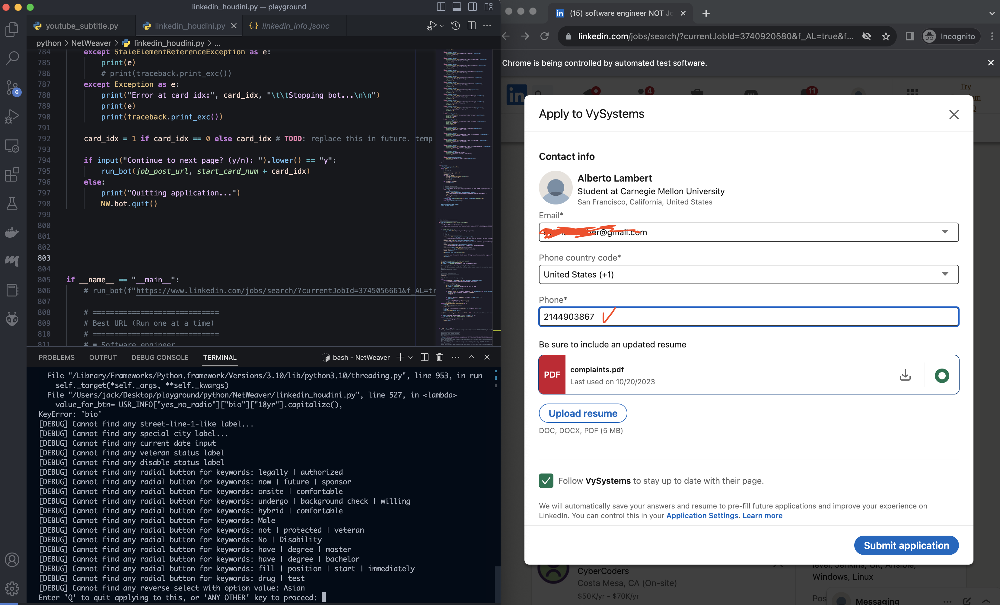

<h1 style="color: white; background: linear-gradient(43deg, #4158D0 0%, #d253c3 58%, #FB5959 100%); text-align: center; padding: 10px; box-shadow: 3px 3px 10px rgba(0,0,0,0.2); font-family: 'Segoe UI', Tahoma, Geneva, Verdana, sans-serif; border-radius: 5px; text-transform: capitalize;">
    Net Weaver
</h1>

Building upon Selenium, this suite of tools aims to achieve things such as automates web testing and simplifies the collection and formatting of references for uses including prompt engineering.

*If you are reading this, you are probably reading the <a href="https://github.com/jacky776690g60/NetWeaver" target="_blank">temporary public repo</a> (used for showcasing what the enxtension can do)*

<h2 style="display: inline-block; padding: 5px 15px; border-radius: 5px; border-bottom: 3px solid #1a252f; font-family: 'Segoe UI', Tahoma, Geneva, Verdana, sans-serif; text-transform: capitalize; letter-spacing: 1.5px; box-shadow: 0px 3px 5px rgba(0,0,0,0.2);">
    Code Snippets
</h2>

- Run test cases
  
  `python -m unittest test.test_netweaver`

# Applications

- ### NetWeaver
  sample Script
  ``` python3
  nw = NetWeaver(
      "https://github.com/jacky776690g60",
      # use_mobile=True,
  )
  nw.set_window_size(DesktopSize.LARGE)
  nw.min_timeout = 0
  nw.max_timeout = 3.
  
  nw.position_window(0, 0)
  
  profile_content_container = nw.wait_get_xpath_elements_present(
      "//turbo-frame[@id='user-profile-frame']/div"
  )
  
  print(profile_content_container, "\n")
  print(profile_content_container[0])

  nw.bot.quit()
  ```


- ### Youtube Subtitle Extractor
  
  Description:
    1. Extract subtitles from given YouTube url. Currently only support the auto-selected language.
    2. Perfect for prompt engineering
    3. The quality of the transcript is solely based on the video uploader him-/her-self or YouTube auto-generated captions

  Sample Scripts:
    
    1. `cd NetWeaver`
    2. Run as module `python3 -m apps.youtube_subtitle -u "https://www.youtube.com/watch?v=LGpEV0cJr6U&ab_channel=VaatiVidya" -s "Secrets of Ringed City"` 

  Samples:

    
    

<!-- - ### LinkedIn Houdini

  Sample Scripts:
  
  1. `python3 -m apps.linkedin_houdini`

  Samples:

     -->

- ### Art Referencer

  Automatically gather art references with keywords on major platforms to inspire your artworks 

  Combine it with tool like <a href="https://github.com/jacky776690g60/Pixelmension">Pixelmension</a>

  Sample Scripts:

  1. `python3 -m apps.art_referencer -k "bloodborne, horse" -s "output/"`

  