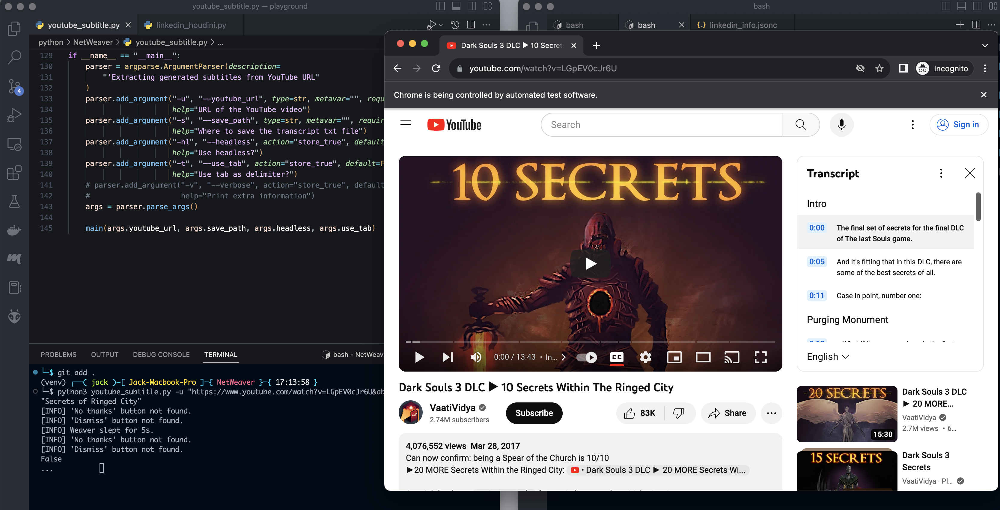
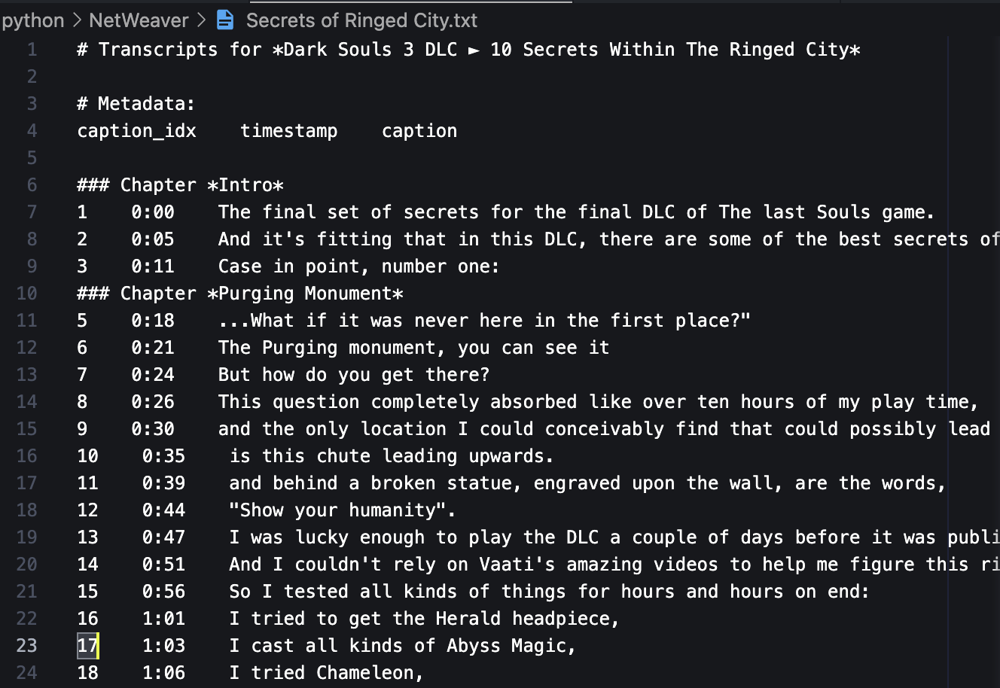
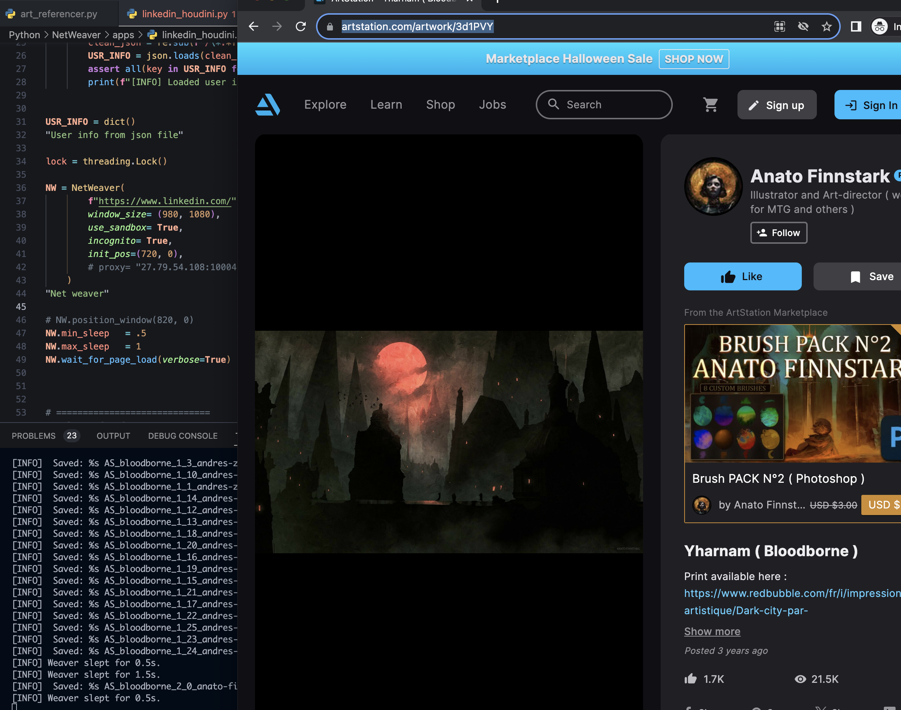

<h1 id="Applications" style="font-weight: 600; text-transform: capitalize; font-family: 'Segoe UI', Tahoma, Geneva, Verdana, sans-serif; color: #99E1D9;">Applications</h1>
<a href='#0' style='background: #000; margin:0 auto; padding: 5px; border-radius: 5px;'>Back to ToC</a>  

This sections contains working applications using `NetWeaver`.

> <h2 id='toc0'>Table of Content</h2>

1. <a href='#InstagramFollowerFollowingScraper'>Instagram Follower/Following Scraper</a>
2. <a href='#YoutubeSubtitleExtractor'>Youtube Subtitle Extractor</a>
3. <a href='#ArtReferencer'>Art Referencer</a>

*Document is still in progress...*
<h1 id="InstagramFollowerFollowingScraper" style="font-weight: 700; text-transform: capitalize; font-family: 'Segoe UI', Tahoma, Geneva, Verdana, sans-serif; color: #EA638C;">&#9698; Instagram Follower/Following Scraper</h1>
<a href='#toc0' style='background: #000; margin:0 auto; padding: 5px; border-radius: 5px;'>Back to ToC</a>  

   ### **Description**
   The scraper will log into the provided Insta account and scrape the followers/following. Then, it will compare the two datasets to see who is following back and who is not.

   ### **Additional Installation**
   1. This app requires `testing chrome driver` and `testing chrome application`
     - You can find them here: <a href='https://googlechromelabs.github.io/chrome-for-testing/known-good-versions-with-downloads.json' target="_blank">Chrome Lab</a>
   2. Copy template `ig_scraper_acc.jsonc` file inside `config/templates` to the `config/` directory.
   3. Modify the `ig_scraper_acc.jsonc` to include your Insta account and password.

   ### **How to Run**
   4. `cd NetWeaver`
   5. Run as module `python3 -m apps.ig_follow_scrape -t {target_ig_username}` 

<h1 id="YoutubeSubtitleExtractor" style="font-weight: 700; text-transform: capitalize; font-family: 'Segoe UI', Tahoma, Geneva, Verdana, sans-serif; color: #EA638C;">&#9698; Youtube Subtitle Extractor</h1>
<a href='#toc0' style='background: #000; margin:0 auto; padding: 5px; border-radius: 5px;'>Back to ToC</a>  
  
   ### **Description**
   1. Extract subtitles from given YouTube url. Currently only support the selected language.
   2. Auto-formatted for prompt engineering
   3. The quality of the transcript is solely based on the video uploader or YouTube auto-generated captions

   ### **How to Run**
   1. `cd NetWeaver`
   2. Run as module `python3 -m apps.youtube_subtitle -u "{youtube_url}" -s "{saved_file_name}"` 

   ### **Samples**
   
   

<h1 id="ArtReferencer" style="font-weight: 700; text-transform: capitalize; font-family: 'Segoe UI', Tahoma, Geneva, Verdana, sans-serif; color: #EA638C;">&#9698; Art Referencer</h1>
<a href='#toc0' style='background: #000; margin:0 auto; padding: 5px; border-radius: 5px;'>Back to ToC</a>  
   
   ### **Description**
   Automatically gather art references with keywords on major platforms to inspire your artworks.

   You can combine it with tool like <a href="https://jacktogon.com/pixelmension">Pixelmension</a>.

   ### **How to Run**
   1. `python3 -m apps.art_referencer -k "bloodborne, horse" -s "output/"`
      - Seperate keywords with comma `,`.

   